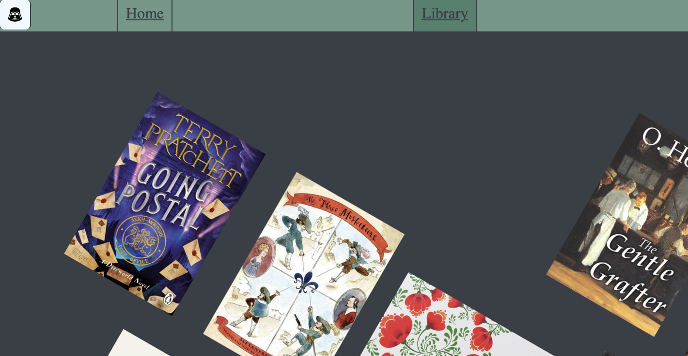
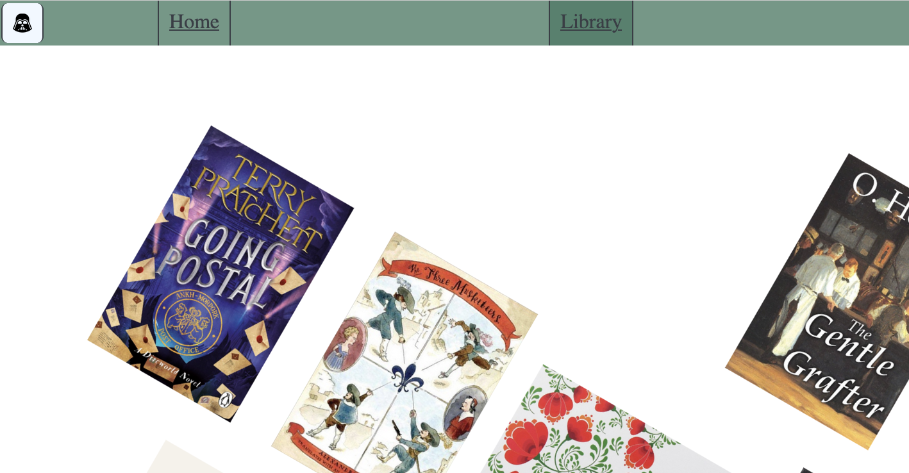
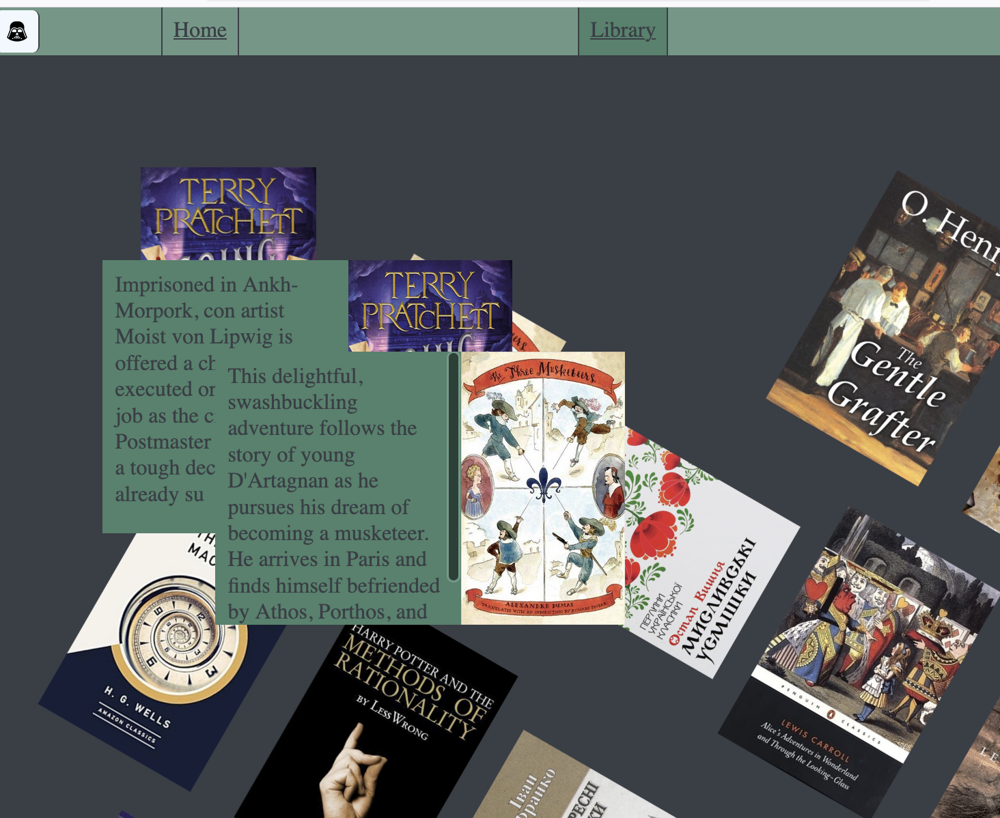
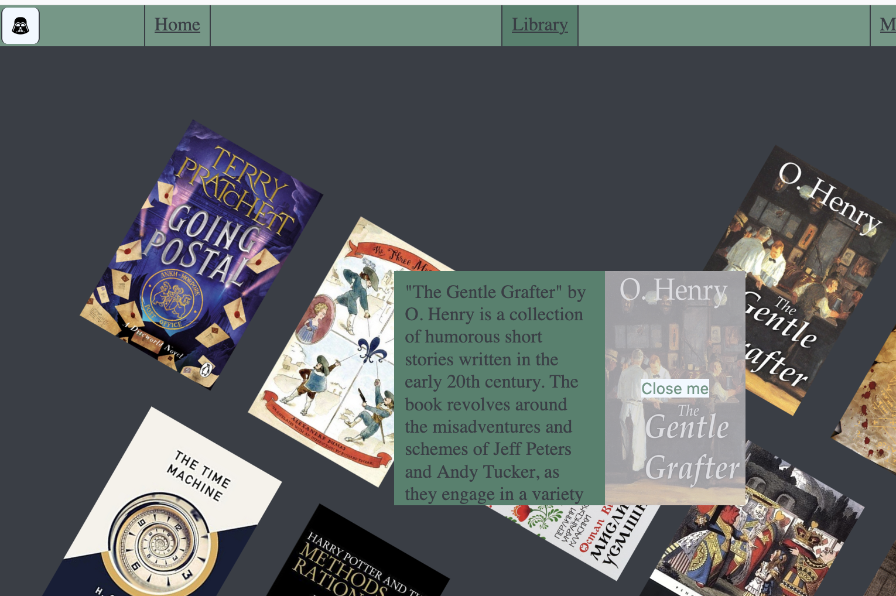

# Documentation
[This](https://olesia73.github.io) is my [odd] personal website that has some basic work-related info and a gallery of my favourite books.
Below is the list of things updated for the final.
## Cursor
The cursor is a custom image fitting the website design. It changes based on the objects at which it points (distinguishing between default, text, and clickables).\
Using cursor parameter makes this so easier and less malfunctioning, but I did not have it in my heart to delete my messy cursor code that took hours to write and was somewhat working.
## Dark Mode
Changing only the background colour of the website, the code keeps the current mode in the local storage variable, initially loaded from the media query. The mode can be changed manually by clicking the Darth Vader icon. The current mode is preserved when switching between pages.


## Modal
In the book cover gallery, each cover is a clickable button that changes the opacity of a respective modal with a brief book description to 1, thus displaying it. 

Each modal has a closing button, which is the book cover that says "close" upon hovering through JavaScript mouse events (the cursor being on it is not visible on screenshots):

I tried to work with arrays more for my final because otherwise my code would be much longer and unreadable. It was interesting to work with elements with technically unique IDs by treating them as strings containing numbers that can be iterated over.
```js
for (let j = 1; j <= 19; j++) {
    modal.push(document.getElementById('m'+String(j)));
    open.push(document.getElementById('b'+String(j)));
    modal[j].querySelector('.close > img').src = 'books/book_' + j + '.jpeg';
    open[j].addEventListener('click', (event) => {
        modal[j].classList.add('show');
        modal[j].style.top = `${event.clientY}px`;
        modal[j].style.left = `${event.clientX / 2}px`;
        typeWriter(j);
    })
}
```
## Typewriting Effect
Upon displaying text, the modal is loaded with a typewriting effect, and I am proud of the fact that it does so independently for different modals. It uses JS Timeout.